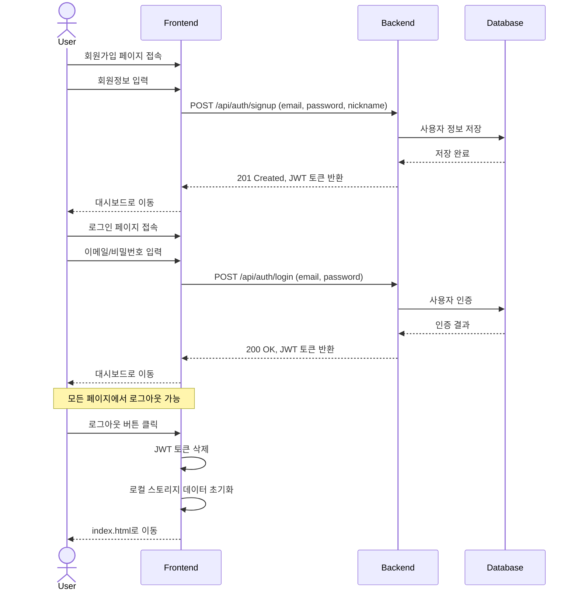
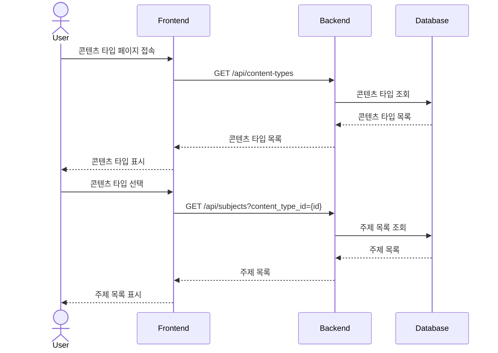
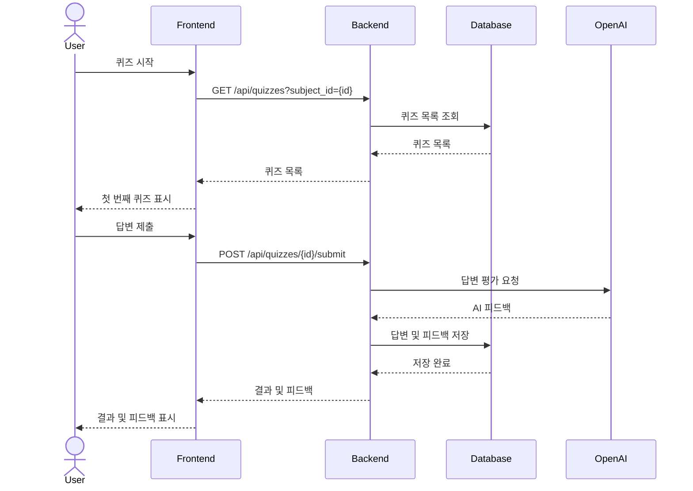
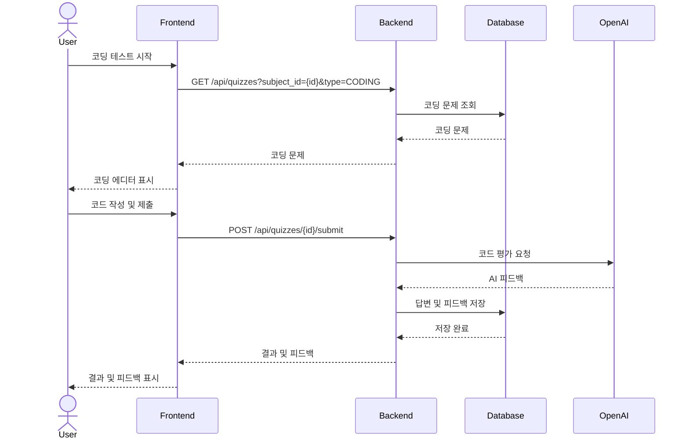
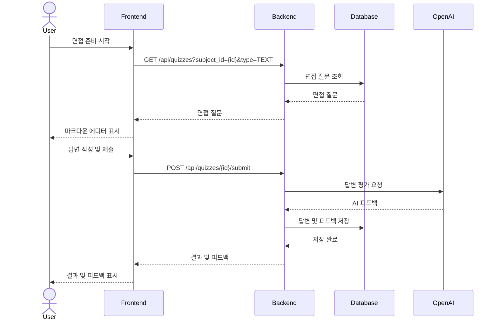
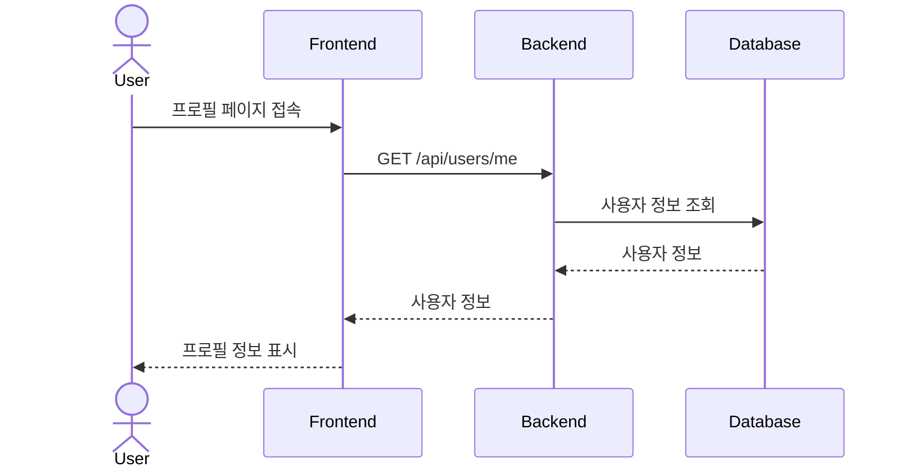
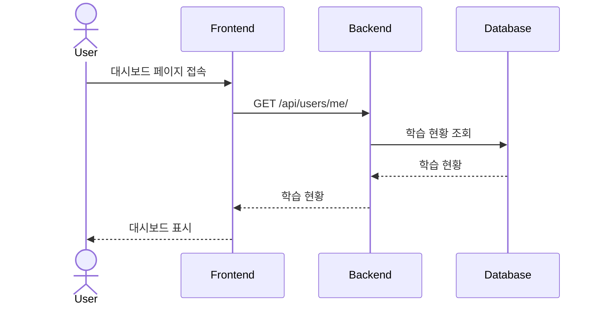

# Sequence Diagrams

다음 시퀀스 다이어그램은 https://mermaid.live/ 에서 작성되었습니다.

## 1. 회원가입/로그인/로그아웃

```mermaid
sequenceDiagram
    actor User
    participant Frontend
    participant Backend
    participant Database

    %% 회원가입
    User->>Frontend: 회원가입 페이지 접속
    User->>Frontend: 회원정보 입력
    Frontend->>Backend: POST /api/auth/signup (email, password, nickname)
    Backend->>Database: 사용자 정보 저장
    Database-->>Backend: 저장 완료
    Backend-->>Frontend: 201 Created, JWT 토큰 반환
    Frontend-->>User: 대시보드로 이동

    %% 로그인
    User->>Frontend: 로그인 페이지 접속
    User->>Frontend: 이메일/비밀번호 입력
    Frontend->>Backend: POST /api/auth/login (email, password)
    Backend->>Database: 사용자 인증
    Database-->>Backend: 인증 결과
    Backend-->>Frontend: 200 OK, JWT 토큰 반환
    Frontend-->>User: 대시보드로 이동

    %% 로그아웃 (모든 페이지에서 가능)
    Note over User,Frontend: 모든 페이지에서 로그아웃 가능
    User->>Frontend: 로그아웃 버튼 클릭
    Frontend->>Frontend: JWT 토큰 삭제
    Frontend->>Frontend: 로컬 스토리지 데이터 초기화
    Frontend-->>User: index.html로 이동
```

## 2. 콘텐츠 타입 및 주제 선택

```mermaid
sequenceDiagram
    actor User
    participant Frontend
    participant Backend
    participant Database

    %% 콘텐츠 타입 목록 조회
    User->>Frontend: 콘텐츠 타입 페이지 접속
    Frontend->>Backend: GET /api/content-types
    Backend->>Database: 콘텐츠 타입 조회
    Database-->>Backend: 콘텐츠 타입 목록
    Backend-->>Frontend: 콘텐츠 타입 목록
    Frontend-->>User: 콘텐츠 타입 표시

    %% 주제 목록 조회
    User->>Frontend: 콘텐츠 타입 선택
    Frontend->>Backend: GET /api/subjects?content_type_id={id}
    Backend->>Database: 주제 목록 조회
    Database-->>Backend: 주제 목록
    Backend-->>Frontend: 주제 목록
    Frontend-->>User: 주제 목록 표시
```

## 3. 퀴즈 진행

```mermaid
sequenceDiagram
    actor User
    participant Frontend
    participant Backend
    participant Database
    participant OpenAI

    %% 퀴즈 시작
    User->>Frontend: 퀴즈 시작
    Frontend->>Backend: GET /api/quizzes?subject_id={id}
    Backend->>Database: 퀴즈 목록 조회
    Database-->>Backend: 퀴즈 목록
    Backend-->>Frontend: 퀴즈 목록
    Frontend-->>User: 첫 번째 퀴즈 표시

    %% 퀴즈 답변 제출
    User->>Frontend: 답변 제출
    Frontend->>Backend: POST /api/quizzes/{id}/submit
    Backend->>OpenAI: 답변 평가 요청
    OpenAI-->>Backend: AI 피드백
    Backend->>Database: 답변 및 피드백 저장
    Database-->>Backend: 저장 완료
    Backend-->>Frontend: 결과 및 피드백
    Frontend-->>User: 결과 및 피드백 표시
```

## 4. 코딩 테스트 진행

```mermaid
sequenceDiagram
    actor User
    participant Frontend
    participant Backend
    participant Database
    participant OpenAI

    %% 코딩 테스트 시작
    User->>Frontend: 코딩 테스트 시작
    Frontend->>Backend: GET /api/quizzes?subject_id={id}&type=CODING
    Backend->>Database: 코딩 문제 조회
    Database-->>Backend: 코딩 문제
    Backend-->>Frontend: 코딩 문제
    Frontend-->>User: 코딩 에디터 표시

    %% 코드 제출
    User->>Frontend: 코드 작성 및 제출
    Frontend->>Backend: POST /api/quizzes/{id}/submit
    Backend->>OpenAI: 코드 평가 요청
    OpenAI-->>Backend: AI 피드백
    Backend->>Database: 답변 및 피드백 저장
    Database-->>Backend: 저장 완료
    Backend-->>Frontend: 결과 및 피드백
    Frontend-->>User: 결과 및 피드백 표시
```

## 5. 면접 준비

```mermaid
sequenceDiagram
    actor User
    participant Frontend
    participant Backend
    participant Database
    participant OpenAI

    %% 면접 문제 시작
    User->>Frontend: 면접 준비 시작
    Frontend->>Backend: GET /api/quizzes?subject_id={id}&type=TEXT
    Backend->>Database: 면접 질문 조회
    Database-->>Backend: 면접 질문
    Backend-->>Frontend: 면접 질문
    Frontend-->>User: 마크다운 에디터 표시

    %% 답변 제출
    User->>Frontend: 답변 작성 및 제출
    Frontend->>Backend: POST /api/quizzes/{id}/submit
    Backend->>OpenAI: 답변 평가 요청
    OpenAI-->>Backend: AI 피드백
    Backend->>Database: 답변 및 피드백 저장
    Database-->>Backend: 저장 완료
    Backend-->>Frontend: 결과 및 피드백
    Frontend-->>User: 결과 및 피드백 표시
```

## 6. 프로필 조회

```mermaid
sequenceDiagram
    actor User
    participant Frontend
    participant Backend
    participant Database

    %% 프로필 정보 조회
    User->>Frontend: 프로필 페이지 접속
    Frontend->>Backend: GET /api/users/me
    Backend->>Database: 사용자 정보 조회
    Database-->>Backend: 사용자 정보
    Backend-->>Frontend: 사용자 정보
    Frontend-->>User: 프로필 정보 표시
```

## 7. 대시보드 조회

```mermaid
sequenceDiagram
    actor User
    participant Frontend
    participant Backend
    participant Database

    %% 대시보드 정보 조회
    User->>Frontend: 대시보드 페이지 접속
    Frontend->>Backend: GET /api/users/me/
    Backend->>Database: 학습 현황 조회
    Database-->>Backend: 학습 현황
    Backend-->>Frontend: 학습 현황
    Frontend-->>User: 대시보드 표시
```